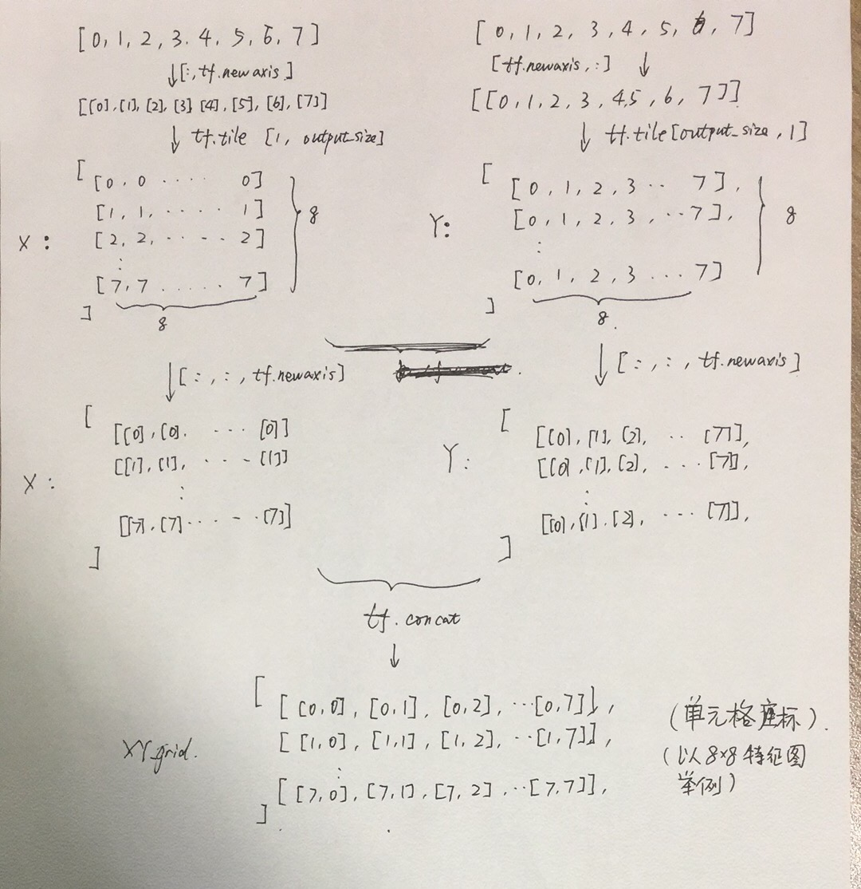

## 解读core/yolov3-->decode(self,conv_output,anchors,stride)
### 输入参数解释
 `conv_output `：经过darknet53以及yoloblock卷积层特征提取后得到的8x8x255、16x16x255、32x32x255特征图的中的任意一个

 `anchors `：预设的三种尺寸anchor中的一种，每一种包含三种宽高比

 `stride `：8、16、32中任意一个，即416x416输入图在输出时被缩放到的尺度

### conv_output中特征图尺度、anchors、stride的对应关系

* 这里的anchor_per_scale为3，即3种宽高比
```
anchor_per_scale = len(anchors) 
```
* conv_output原本是batch_sizex8x8x255(这里用8举例),本步操作将255拆成3部分，分别对应3个预选框, 每个维度85
```
conv_output = tf.reshape(conv_output, (batch_size, output_size, output_size, anchor_per_scale, 5 + self.num_class))
```
* 取出tx、ty、tw、th、置信度、80个类别
```
conv_raw_dxdy = conv_output[:, :, :, :, 0:2]
conv_raw_dwdh = conv_output[:, :, :, :, 2:4]
conv_raw_conf = conv_output[:, :, :, :, 4:5]
conv_raw_prob = conv_output[:, :, :, :, 5: ]
```

* 上面都好理解，以下部分烧脑，算了好几遍才明白本段代码的作用，需要了解tf.tile, tf.newaxis方法的用处
```
y = tf.tile(tf.range(output_size, dtype=tf.int32)[:, tf.newaxis], [1, output_size])
x = tf.tile(tf.range(output_size, dtype=tf.int32)[tf.newaxis, :], [output_size, 1])
xy_grid = tf.concat([x[:, :, tf.newaxis], y[:, :, tf.newaxis]], axis=-1)
```

* 接下来是这部分代码的过程图示
<div>

<div>

* 这部分代码在单元格坐标矩阵基础上，将size扩展到与输入特征图一致，加入batch_size、anchors维度，但最后一个维度仍然存放单元格左上角坐标
```
xy_grid = tf.tile(xy_grid[tf.newaxis, :, :, tf.newaxis, :], [batch_size, 1, 1, anchor_per_scale, 1])
xy_grid = tf.cast(xy_grid, tf.float32)
```
* 激活函数对tx、ty处理后加上所属单元格左上角坐标cx、cy，但这里为什么要乘以stride，不是应该除以stride吗？？？
```
pred_xy = (tf.sigmoid(conv_raw_dxdy) + xy_grid) * stride
```
* tw、th指数后乘以预选框的pw、ph，但这里乘以stride同样疑问？？？
```
pred_wh = (tf.exp(conv_raw_dwdh) * anchors) * stride
```
* 合并xywh
```
pred_xywh = tf.concat([pred_xy, pred_wh], axis=-1)
```
* 对于80分类，没有使用softmax，而是对每个维度使用sigmod
```
pred_conf = tf.sigmoid(conv_raw_conf)
pred_prob = tf.sigmoid(conv_raw_prob)
```
* 返回4+1+80=85个维度
```
return tf.concat([pred_xywh, pred_conf, pred_prob], axis=-1)
```
